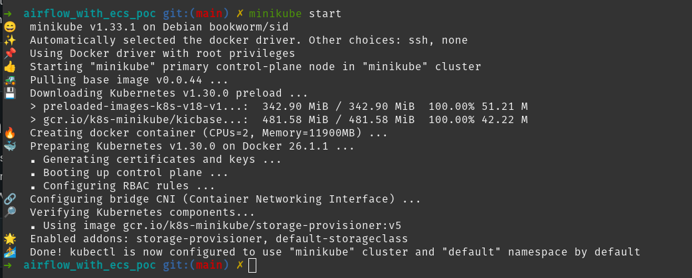

# Airflow Playground

I built this Repo as part of Proof of Concept for my blog posts:

- <https://chris.towles.me/blog/apache-airflow-part-1-why-and-goals>

## My goals

I am however going to put a few constraints in place around how I want to use Airflow.

- Can't use [AWS MWAA](https://aws.amazon.com/mwaa/) (it's not offered in AWS US Gov East)
- Local Development
  - Changes to a job must be able to be tested locally before being pushed
- CICD Pipeline
  - Changes to a job must be able to be deployed to production via a CI/CD pipeline.
- Job Management
  - Offer Web UI to view and re-trigger jobs
  - prefer Code first and config rather UI based.
  - Time to modify a job should be less than 5 minutes.
  - Time to create a job should be less than 30 minutes.
- Cost
  - I'd like as close to zero cost as possible, ideally spinning down to near no resource usage when no jobs running.
- Maintenance
  - Would like to be able to deploy new versions of the Airflow container on ECS or EKS
    - This isn't a hard requirement could use an EC2 instance and updated in place but that another box to maintain long term.
      - If instead it was just ECS pointing at an RDS database, you could restore the DB from snapshot and test a deployment before release to production.

## Links

- <https://aws.amazon.com/blogs/containers/running-airflow-on-aws-fargate/>

## Examples I've reviewed

- <https://github.com/NASA-IMPACT/self-managed-apache-airflow>
  - terraform stack
- <https://github.com/nicor88/aws-ecs-airflow>
- terraform stack
- <https://github.com/andresionek91/airflow-autoscaling-ecs>
  - CloudFormation
- <https://github.com/aelzeiny/airflow-aws-executors>
  - AWS Executor that delegates every task to a scheduled container on either AWS Batch, AWS Fargate, or AWS ECS.

## Steps for initial setup

- [Install docker](https://docs.docker.com/engine/install/)
- [Install minikube](https://minikube.sigs.k8s.io/docs/start/)
- start minicube

```bash
## start
minikube start`
```

> if you get an error `docker: Not healthy: "docker version --format {{.Server.Os}}-{{.Server.Version}}:{{.Server.Platform.Name}}" exit status 1: permission denied while trying to connect to the Docker daemon socket a....`
>
> You need to <https://docs.docker.com/engine/install/linux-postinstall/> and retry.



- [Install kubectl](https://kubernetes.io/docs/tasks/tools/)

```bash
# check everything started correctly
kubectl get all -A
```

- [Install helm](https://helm.sh/docs/intro/install/)

- Add the Apache Airflow Helm chart repository:

```bash
helm repo add apache-airflow https://airflow.apache.org
helm upgrade --install airflow apache-airflow/airflow --namespace airflow --create-namespace
```

Install result.


```bash
## forward port for Airflow webserver URL 
kubectl port-forward svc/airflow-webserver 8080:8080 --namespace airflow

```

> Note!
> kubectl port-forward does not return. To continue with the exercises, you will need to open another terminal.

## Access Airflow UI

