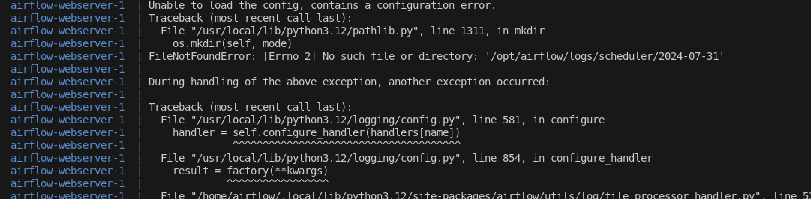

# Docker cheat sheet

## list all containers

```bash

# all running containers
docker ps

# all containers
docker ps -a
```

## Open shell in container

```bash
docker compose exec -it airflow-cli /bin/bash
```

## Cleanup

```bash
docker system prune
systemctl restart docker.service
```

## Kill running containers

```bash
docker kill $(docker ps -q)
```


## Issues

### permission denied to mounded folders

When doing docker compose up, you might get a permission denied error for the mounted folders. This is because your user does not have access to these directories. You can fix this by adding yourself to the docker group or using sudo.

```text
airflow-webserver-1  | PermissionError: [Errno 13] Permission denied: '/opt/airflow/logs/scheduler'
```



The solution is to run `chmod 777 ./logs` for each of the directories that you want to give access.

You can also do them all with.

```bash
sudo chmod 777 ./dags ./logs ./plugins ./config

# or if using a AIRFLOW_PROJ_DIR
sudo chmod -R 777 ./airflow-mounts
```
